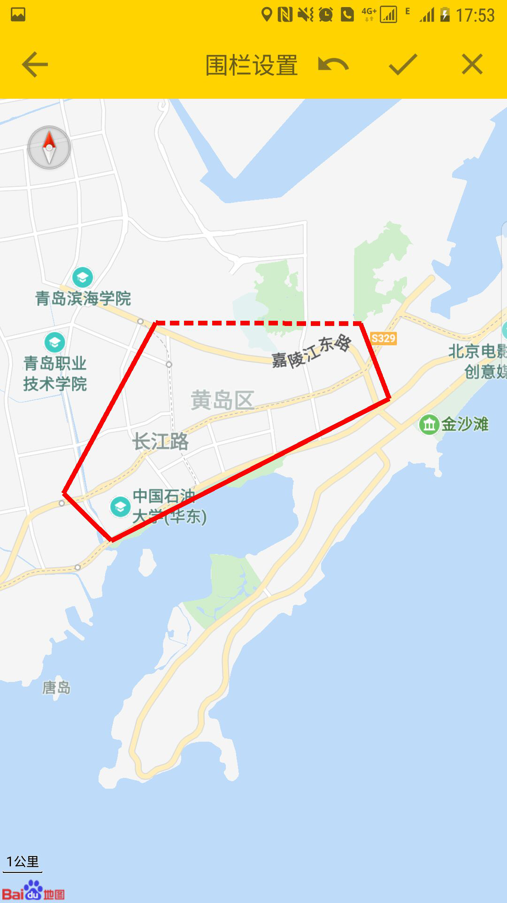
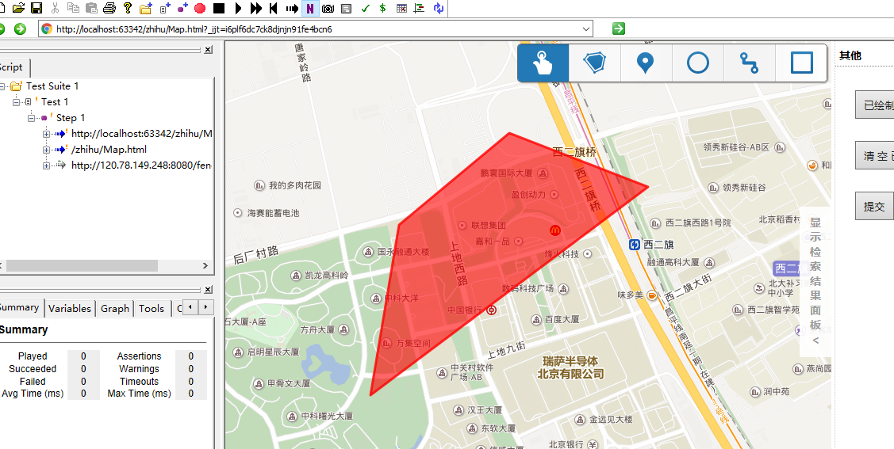

# 智护服务端

### 项目介绍
该项目是`智护`的服务端,`智护`是一套涵盖智能穿戴设备端、服务器端、安卓端app以及网页端的老人关怀系统。设计本套系统旨在对老人的日常活动及身体状况进行监控和记录，并通过服务器后端对智能设备信息分析并传送至老人家属的手机app及网页，以保护老人。本系统通过老人的佩戴的智能设备采集老人的位置、心率等信息，传送信息至服务器端；服务器端对数据进行分析并将提醒和预警信息发送至安卓app端及网页端。
### 项目截图
app端围栏

web端围栏

走出围栏提示

### 项目部署
该项目采用`spring-boot`开发，采用`docker`进行部署  
运行`deploy.sh`可以进行部署项目
